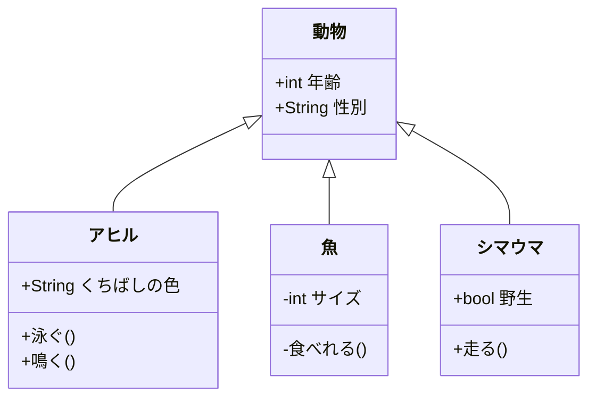

```mermaid
classDiagram
    動物 <|-- アヒル
    動物 <|-- 魚
    動物 <|-- シマウマ
    動物 : +int 年齢
    動物 : +String 性別
    class アヒル{
        +String くちばしの色
        +泳ぐ()
        +鳴く()
    }
    class 魚{
        -int サイズ
        -食べれる()
    }
    class シマウマ{
        +bool 野生
        +走る()
    }
```
